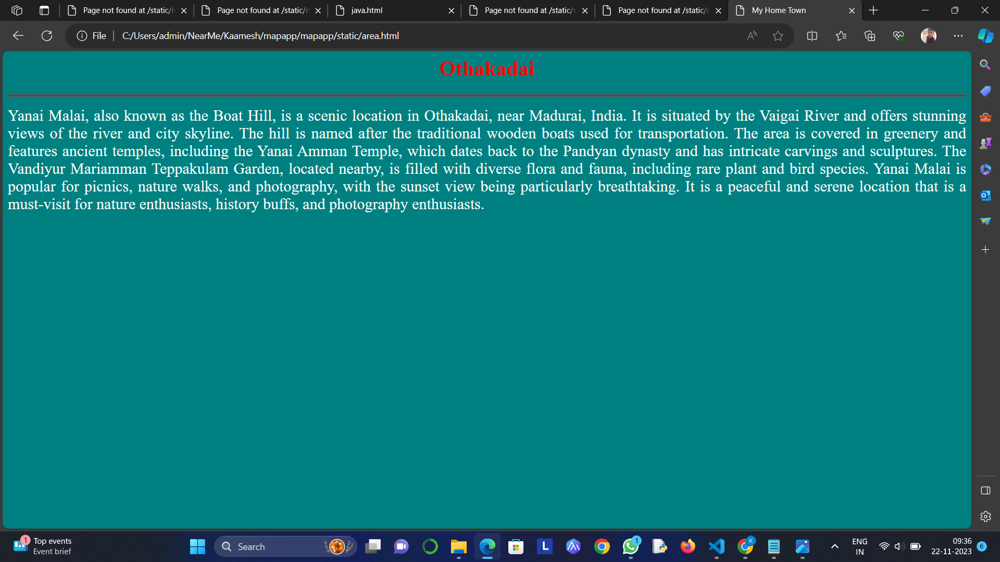

# Ex04 Places Around Me
## Date: 22.11.2023

## AIM
To develop a website to display details about the places around my house.

## DESIGN STEPS

### STEP 1
Create a Django admin interface.

### STEP 2
Download your city map from Google.

### STEP 3
Using ```<map>``` tag name the map.

### STEP 4
Create clickable regions in the image using ```<area>``` tag.

### STEP 5
Write HTML programs for all the regions identified.

### STEP 6
Execute the programs and publish them.

## CODE
```
map.html

<html>
<head>
<title>My City</title>
</head>
<body>
<h1 align="center">
<font color="red"><b>Madurai</b></font>
</h1>
<h3 align="center">
<font color="blue"><b>Kaamesh M (23006782)</b></font>
</h3>
<center>

<map name="MyCity">
<area shape="rect" coords="680,220,790,270" href="home.html" title="My Home Town">
<area shape="rect" coords="980,340,1130,380" href="temple.html" title="Teppakulam">
<area shape="rect" coords="720,420,790,480" href="cinemas.html" title="Vetri Cinemas">
<area shape="rect" coords="770,280,840,320" href="mahal.html" title="Thirumalai Nayakkar Mahal">
<area shape="rect" coords="450,190,585,220" href="area.html" title="Othakadai">
 </map>
</center> 
</body>
</html>


home.html

<html>
<head>
<title>My Home Town</title>
</head>
<body bgcolor="green">
<h1 align="center">
<font color="white"><b>Madurai</b></font>
</h1>
<hr size="3" color="red">
<p align="justify">
<font face="" size="5" color="white">
    Madurai, located in Tamil Nadu, India, is a historic city with a rich cultural heritage, ancient temples, and vibrant traditions. Surrounded by hills and situated on the banks of the Vaigai River, it's famous for the Meenakshi Amman Temple, a significant and popular temple dedicated to the goddess Meenakshi. The city is also known for its traditional sarees, woven using ancient techniques and adorned with intricate designs and patterns, as well as its jasmine flowers, used to make garlands and symbolizing love and purity. The food in Madurai is a blend of spicy and sweet flavors, with popular dishes including steamed rice cakes, sweet rice pudding, and spicy lentil soup. Madurai is a hub for education and learning, with renowned educational institutions and research centers located in the city. It's easily accessible by road, rail, and air, making it a must-visit destination for those interested in exploring the rich heritage of South India.
</font><br>
</p>
</body>
</body>
</html>


temple.html

<html>
<head>
<title>My Home Town</title>
</head>
<body bgcolor="burlywood">
<h1 align="center">
<font color="red"><b>Teppakulam</b></font>
</h1>
<hr size="3" color="red">
<p align="justify">
<font face="" size="5" color="black">
    Teppakulam, a man-made lake in Madurai, Tamil Nadu, India, was built by the Nayak dynasty during the 17th century. Spread over 12 hectares, the lake is surrounded by lush greenery and is a peaceful and scenic spot for locals and tourists alike. The crystal-clear water allows one to see the lake bed from the surface. The lake is home to various aquatic life such as fish, turtles, and waterfowl. The area around the lake is dotted with temples and shrines, including the Teppakulam Nayak Palace, now a heritage site. This palace, built by the Nayak dynasty, served as a royal residence. Today, it houses a museum showcasing the region's history and culture. During the annual Chithirai Festival in April, the lake is illuminated with thousands of colorful lamps, creating a mesmerizing sight. Teppakulam's serene beauty, cultural significance, and rich history make it a must-visit destination for anyone traveling to Madurai.
</font><br>
</p>
</body>
</body>
</html>


cinemas.html

<html>
<head>
<title>My Home Town</title>
</head>
<body bgcolor="purple">
<h1 align="center">
<font color="red"><b>Vetri Cinemas</b></font>
</h1>
<hr size="3" color="red">
<p align="justify">
<font face="" size="5" color="white">
    Vetri Theatre, also known as Kamarajar Mani Mandapam, is a historic cultural center in Madurai, India. Built in 1955 during Kamarajar's tenure as Chief Minister of Tamil Nadu, it's named after his son, a prominent actor and producer in the Tamil film industry. With a seating capacity of around 1,000 people, it hosts a variety of cultural events, including plays, concerts, dance performances, and film screenings, and is equipped with modern audio-visual facilities. The theater's unique architecture combines traditional Tamil elements with modern design, with intricate carvings and sculptures on the exterior and natural light filtering in through large windows inside. Vetri Theatre has contributed significantly to promoting Tamil culture and heritage, hosting renowned artists like M.S. Subbulakshmi, K.J. Yesudas, and Bharathiyar, as well as providing opportunities for upcoming talent. It's maintained by the Madurai Corporation and is open to the public, making it a popular venue for cultural events and a testament to Madurai's rich cultural heritage.
</font><br>
</p>
</body>
</body>
</html>


mahal.html

<html>
<head>
<title>My Home Town</title>
</head>
<body bgcolor="orange">
<h1 align="center">
<font color="red"><b>Thirumalai Nayakkar Mahal</b></font>
</h1>
<hr size="3" color="red">
<p align="justify">
<font face="" size="5" color="black">
    Thirumalai Nayakkar Mahal, a historic palace in Madurai, India, was built by King Thirumalai Nayakkar in the 17th century as part of his royal residence. The palace showcases the Indo-Saracenic architectural style, a blend of traditional Indian, Islamic, and European elements. Spread over 4 acres and surrounded by a moat, the palace has four wings with separate courtyards, and the most impressive part is the central hall, Swarga Vilasam, which has a two-storeyed dome-shaped roof made of granite. The walls are decorated with intricate frescoes and paintings depicting scenes from Hindu mythology, and natural light filters through the latticework on the windows. The palace also has a beautiful garden, Meenakshi Amman Temple Garden, adjacent to the temple. The palace is a protected monument maintained by the Archaeological Survey of India and is open to visitors to explore and learn about Madurai's rich cultural heritage.
</font><br>
</p>
</body>
</body>
</html>


area.html

<html>
<head>
<title>My Home Town</title>
</head>
<body bgcolor="teal">
<h1 align="center">
<font color="red"><b>Othakadai</b></font>
</h1>
<hr size="3" color="red">
<p align="justify">
<font face="" size="5" color="white">
    Yanai Malai, also known as the Boat Hill, is a scenic location in Othakadai, near Madurai, India. It is situated by the Vaigai River and offers stunning views of the river and city skyline. The hill is named after the traditional wooden boats used for transportation. The area is covered in greenery and features ancient temples, including the Yanai Amman Temple, which dates back to the Pandyan dynasty and has intricate carvings and sculptures. The Vandiyur Mariamman Teppakulam Garden, located nearby, is filled with diverse flora and fauna, including rare plant and bird species. Yanai Malai is popular for picnics, nature walks, and photography, with the sunset view being particularly breathtaking. It is a peaceful and serene location that is a must-visit for nature enthusiasts, history buffs, and photography enthusiasts.
</font><br>
</p>
</body>
</body>
</html>
```

## OUTPUT





## RESULT
The program for implementing image maps using HTML is executed successfully.
